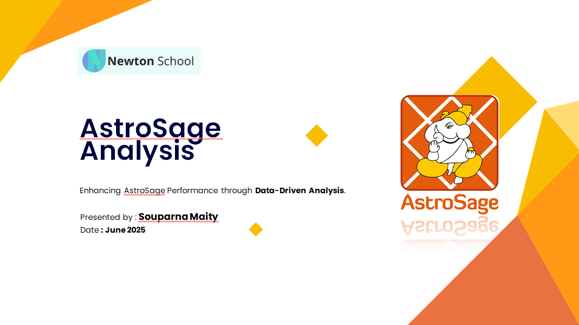

📞 AstroSage Call Center Performance Analysis (Excel Dashboard)

This project presents a comprehensive Excel-based analysis of AstroSage’s call center operations, focusing on operational efficiency, customer satisfaction, and revenue performance.

Using historical interaction data, the dashboard identifies performance bottlenecks, peak-hour workload imbalances, consultation completion gaps, and satisfaction trends to support data-driven investment decisions.

🎯 Key Objectives

Analyze daily and hourly call volume trends

Evaluate consultation completion rates

Measure customer satisfaction patterns

Assess agent performance distribution

Identify revenue drivers by consultation type

Recommend strategic allocation of ₹1 Crore investment

🔍 Key Insights

Only ~41% of calls are successfully completed

~58% of calls are failed, busy, or incomplete

79% of calls occur between 5 AM – 5 PM (Peak Load Window)

78% of revenue is generated from Call consultations

Average customer rating: 2.9 (indicating moderate satisfaction)

Strong correlation (0.99) between agent earnings and net revenue

📊 Dashboard Features

KPI Cards (Revenue, Calls, Gurus, Avg Rating)

Hourly Call Distribution Analysis

Day-by-Day Call Volume Trends

Call & Chat Status Breakdown

Revenue by Consultation Type

Top 10 Gurus by Rating

Rating-wise User Distribution

Interactive Filters (Year, Date, Rating, Consultation Type)

🛠 Tools & Functions Used

Pivot Tables

SUMIF(), COUNTIF(), AVERAGE(), CORREL()

Conditional Formatting

Scenario Manager & What-If Analysis

Data Cleaning & Transformation

💡 Strategic Recommendation

A data-backed ₹1 Crore investment strategy was proposed:

40% → Technology Upgrades

30% → Agent Training Programs

20% → Selective Hiring

10% → Marketing & Retention

The goal is to improve completion rates, enhance customer satisfaction, and increase revenue efficiency.
